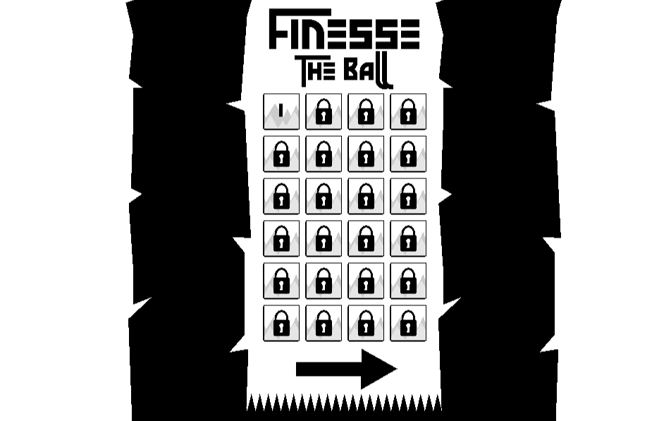
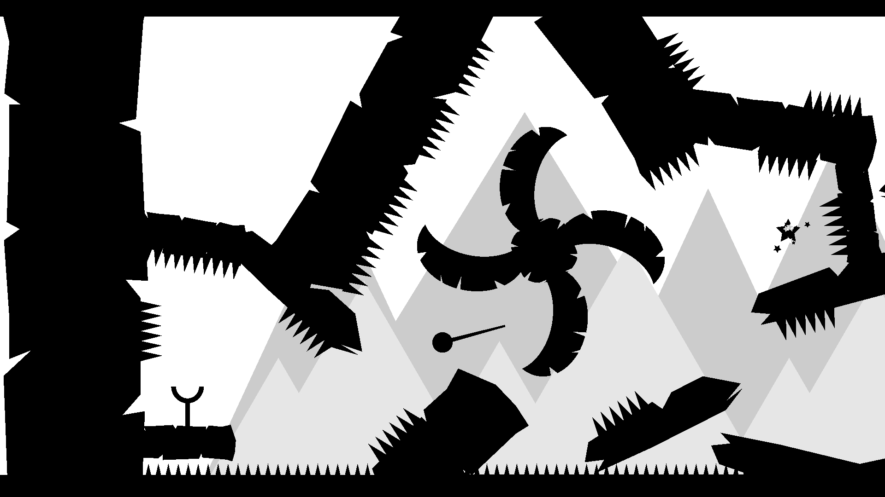

# Finesse The Ball

Finesse The Ball is an exciting and challenging browser-based game developed with Unity 2018. In this game, you'll need to touch the ball to slow down time, drag, and slingshot your way to the finish line while skillfully avoiding various objects thrown at you and collecting stars.

## Gameplay

- Touch the ball to slow down time.
- Drag the ball to aim and adjust your trajectory.
- Release to sling your ball towards the finish line.
- Avoid obstacles and collect stars to earn points and progress through the levels.

## Play the Game

You can play "Finesse The Ball" directly in your web browser by following this link: [Play Finesse The Ball](https://jameshartley.itch.io/finesse)

Click the image above to watch a gameplay preview.

## Features

- Exciting and challenging gameplay that tests your reflexes and precision.
- Engaging levels with a variety of obstacles and puzzles.
- Intuitive touch and drag controls for an immersive gaming experience.
- Beautifully designed graphics and animations

## Using the Project

This is an unfinished game in Unity 2018. I Hope it shows you some basics of touch controls and building levels. Feel free to use it in your personal projects, just don't sell it as it.

